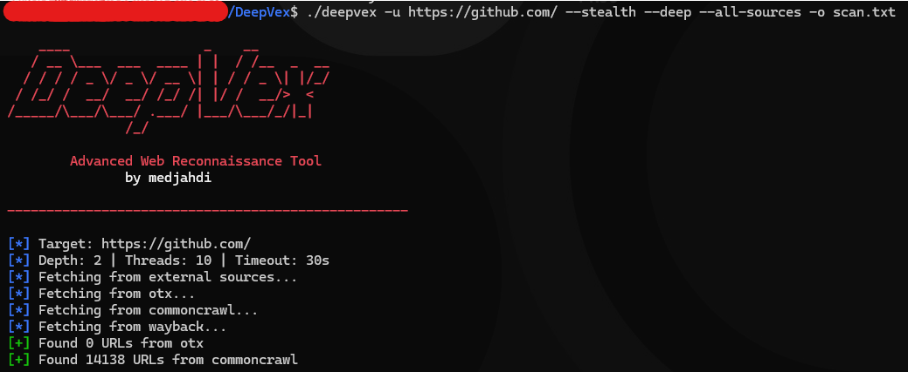

# DeepVex

```
    ____                 _    __         
   / __ \___  ___  ____ | |  / /__  _  __
  / / / / _ \/ _ \/ __ \| | / / _ \| |/_/
 / /_/ /  __/  __/ /_/ /| |/ /  __/>  <  
/_____/\___/\___/ .___/ |___/\___/_/|_|  
               /_/                        
```

**Advanced Web Reconnaissance Tool**

DeepVex is a fast, comprehensive web reconnaissance tool built in Go. Designed for security professionals who need efficient endpoint discovery, parameter analysis, and deep content inspection.



---

## Features

**Core Capabilities**
- Fast async web crawling with configurable depth and concurrency
- JavaScript endpoint extraction from JS files
- Sensitive parameter detection in URLs and forms
- Hidden form field discovery
- Subdomain extraction from response bodies
- AWS S3 bucket detection

**External Sources**
- Wayback Machine integration
- CommonCrawl data fetching
- AlienVault OTX threat intelligence

**Stealth Mode**
- Random User-Agent rotation
- Request delay randomization
- Browser-like header simulation

**Deep Analysis**
- API key and secret detection (AWS, GitHub, Slack, Stripe, JWT)
- AJAX/XHR endpoint parsing
- WAF/CDN detection (Cloudflare, AWS WAF, Akamai, Imperva)
- Backup file discovery
- Source map parsing

---

## Installation

```bash
git clone https://github.com/medjahdi/DeepVex.git
cd DeepVex
go mod tidy
go build -o deepvex .
```

---

## Usage

**Basic scan**
```bash
./deepvex -u https://target.com
```

**Full reconnaissance**
```bash
./deepvex -u https://target.com -d 3 -t 20 --stealth --deep --all-sources --subs -o results.txt
```

**With proxy (Burp Suite)**
```bash
./deepvex -u https://target.com -p http://127.0.0.1:8080
```

**JSON output**
```bash
./deepvex -u https://target.com --deep -o results.json --json
```

---

## Options

| Flag | Description | Default |
|------|-------------|---------|
| `-u, --url` | Target URL (required) | - |
| `-d, --depth` | Maximum crawl depth | 2 |
| `-t, --threads` | Concurrent threads | 10 |
| `-m, --timeout` | Request timeout (seconds) | 30 |
| `-k, --delay` | Delay between requests (seconds) | 0 |
| `--random-delay` | Random delay jitter (ms) | 0 |
| `-p, --proxy` | Proxy URL | - |
| `-c, --cookie` | Cookie string | - |
| `-H, --header` | Custom header (repeatable) | - |
| `-a, --user-agent` | Custom User-Agent | - |
| `--no-redirect` | Disable redirects | false |
| `--stealth` | Enable stealth mode | false |
| `--random-ua` | Random User-Agent per request | false |
| `--deep` | Enable deep analysis | false |
| `--subs` | Include subdomains | false |
| `--wayback` | Fetch from Wayback Machine | false |
| `--commoncrawl` | Fetch from CommonCrawl | false |
| `--otx` | Fetch from AlienVault OTX | false |
| `--all-sources` | Fetch from all sources | false |
| `-o, --output` | Output file path | - |
| `--json` | JSON output format | false |
| `-v, --verbose` | Verbose output | false |
| `-q, --quiet` | Suppress console output | false |

---

## Output Types

| Type | Description |
|------|-------------|
| `[href]` | HTML links |
| `[form]` | Form actions |
| `[js]` | JavaScript files |
| `[linkfinder]` | URLs from JS |
| `[sensitive-param]` | Sensitive parameters |
| `[hidden-field]` | Hidden form fields |
| `[api-key]` | Detected secrets |
| `[ajax-endpoint]` | AJAX endpoints |
| `[waf-detected]` | WAF/CDN info |
| `[backup-probe]` | Backup files |
| `[subdomain]` | Subdomains |
| `[aws-s3]` | S3 buckets |

---

## Sponsor

If you find this tool useful, consider supporting development:

[Support via PayPal](https://www.paypal.com/ncp/payment/BNSJG52TFE5B2)

---

## Disclaimer

This tool is for authorized security testing only. Always obtain proper permission before scanning any target. The author is not responsible for misuse.

---

## License

MIT License - see LICENSE file for details.

---

**Author:** medjahdi
